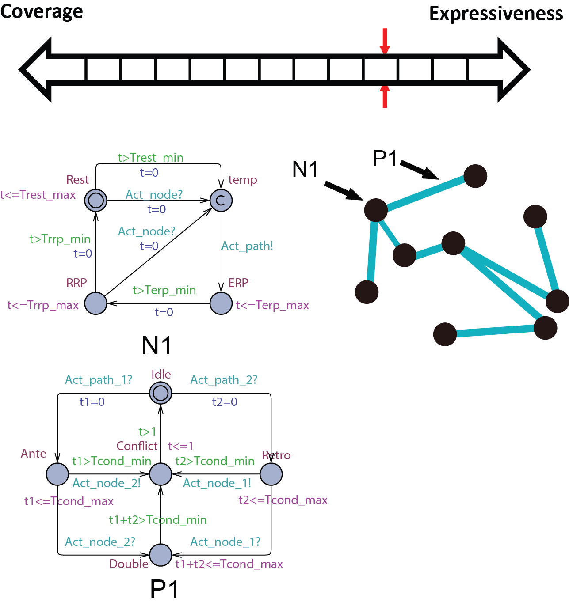
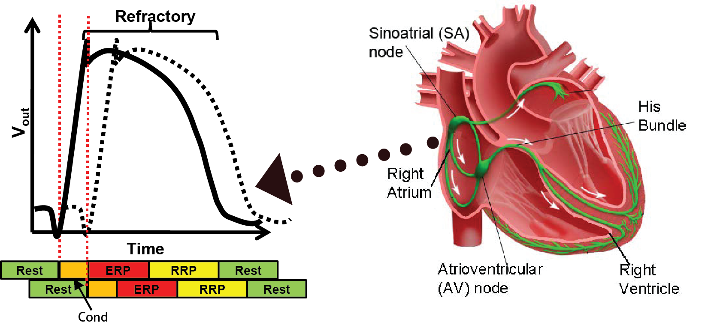
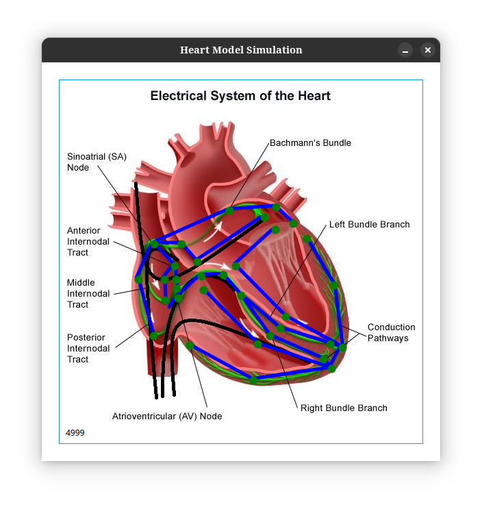

# Medical-Cyber-Physical-System
A heart model simulation from mlab-upenn research group


<p>
    
    <h4>Abstract conduction delay with paths</h4>
    <p>
        In this abstraction, we replace the *cond* state of N0 with path automata. The heart model H0 can be replaced by 
        <br>
            
        <br>
        . A more general abstraction abstracts 3 nodes and 2 paths into 2 nodes and 1 path: 
        <br>
            
        <br>
        . With this property, we can further abstract the structure of the model. The heart model H0.5 can be further abstracted into
        <br> 
            
        <br>
        where m=9 in the structure shown on the right.
        <p><strong>Proposed use:</strong></p> 
        <ul class="list-unstyled"> 
            <li>Study heart conditions with additional pathways including reentry circuits.</li>
            <li>Patient-specific heart model for general Electrophysiology Study.</li>
        </ul>
    </p>
</p>


The components of the cardiac action potential cycle, including the periods of rest, conduction, ERP (Effective Refractory Period), RRP (Relative Refractory Period), and the rest (diastolic) period.




## Building instructions
### Requirements
- GCC
- CMake

### Bash commands
from the root directory of the project, run the following commands:
```bash
mkdir build
cmake -Bbuild -G "MinGW Makefiles"
cmake --build build --config Debug --target all -j 10 --
build\MyHeart.exe                                       
```
## UI
The current stage of the project is to build a UI for the heart model. The UI will be built using Qt/QML. The UI will be used to visualize the heart model and the action potential cycle.

It is the stage of debugging now. the model seems to not send the activation signal forward form the SA to the path.

